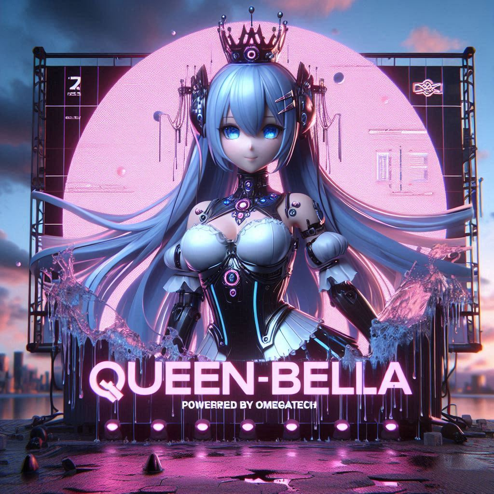

# Queen Bella Bot



A WhatsApp bot built with love and power by OmegaTech.# Queen Bella Bot
<a href="https://wa.me/23234675912" target="_blank">
  
</a>

<style>
@keyframes glitch {
  0% { text-shadow: 0 0 5px #f0f, 0 0 10px #0ff; }
  25% { text-shadow: 1px 0 red, -1px 0 blue; }
  50% { text-shadow: 0 0 20px lime, 0 0 30px red; }
  75% { text-shadow: -1px 0 green, 1px 0 yellow; }
  100% { text-shadow: 0 0 5px #f0f, 0 0 10px #0ff; }
}

.glitch-text {
  font-size: 32px;
  color: white;
  text-align: center;
  animation: glitch 0.8s infinite;
  font-family: monospace;
}
</style>

<div class="glitch-text">
  👑 I am QUEEN-BELLA<br>
  💥 Powerful Bot by OMEGA
</div>

## Instalasi awal

1. Update package

```bash
apt update && apt upgrade
```

2. Install nodejs

```bash
apt install nodejs -y
```

3. Install ffmpeg (ini diperlukan untuk mengkonversi ke format webp terutama pada "stiker")

```bash
apt install ffmpeg -y
```

4. Install git

```bash
apt install git
```

5. Cloning repo

```bash
git clone https://github.com/Omegatech01/QUEEN-BELLA.git
```

## Cara Pasang

### Prasyarat

1. When you get this source code, make sure to install all the necessary modules by running this command in the terminal or command prompt:

```bash
cd /halaman/mengarah/ke/QUEEN-BELLA 
```
```bash
npm install
```

2. After finishing the installation, run the bot with the command

```bash
npm start
```

### How to Connect to a WhatsApp Number"

1. After the bot is running, there will be an option to connect to your WhatsApp number via QR code or pairing.

2. If you choose QR, you will need an additional device. It is recommended to use the pairing option.

3. If you choose pairing:

Enter your WhatsApp number, for example: 2323467××××.

Copy the displayed code.

Open your WhatsApp and follow these steps:

Click the three dots at the top right.

Select "Linked Devices" > "Log in with phone number".

Enter the code you copied earlier.

Wait for the connection process; this may take some time.


If you encounter difficulties, try deleting the folder lib/connection/session and restart the bott.

---

### Cara Mengimpor Modul

```javascript
const fs = "fs".import(); 
// Atau bisa gunakan await untuk mengatasi promise
//const fs = await "fs".import()
```

---

### How to Import Modules

const fs = "fs".import(); 
// Or you can use await to handle the promise
//const fs = await "fs".import()


---

How to Import Functions

Function imports always start from the root, so there is no need to go backward using ../../. Everything starts from the root!

For example, if we want to import events.js located at ./tolkit/events.js from ./helpers/client.js, the import is done like this:

const events = await "./tolkit/events.js".r()


---

Using Event Emitters

Adding or modifying files inside the ./helpers/Events folder is automatically detected.

Here are the parts available in these events:

ev.on({
    cmd: [''], // These are the command features used as event triggers, you can put many cmds
    listmenu: [''], // This part will be visible in the menu
    tag: "", // This tag determines in which menu section the list menu will be placed
    energy: 7, // Energy cost to use this event
    premium: false, // Whether premium access is required to use this feature
    args: "Enter text!", // Requires input text or quoted text
    badword: false, // Blocks bad words in args
    media: { // Requires media
        type: ["audio"], // Requires media of type audio (types can include audio, document, video, image, sticker) and can be used together in an array
        msg: "Reply with the audio?", // Response if no audio is replied
        etc: { // Others
            seconds: 360, // Maximum audio length 360 seconds
            msg: "Audio cannot be longer than 360 seconds!" // Response if longer than 360 seconds
        },
        save: false // If true, media will be saved as an audio.mp3 file
    },
    urls: { // Requires url
        formats: ["pinterest.com","pin.it"], // URL formats
        msg: true // Response message or msg: 'reply message content'
    },
    isMention: true, // Requires mention (tag/reply/number input)
    isQuoted: false, // Requires quoted message
}, ({ media }) => {
    // media is the returned downloaded media,
    // if save is false then media is a buffer,
    // if save is true then media is the name of the saved file
});
```

## 🙌 Thanks to All Contributors

Thank you to everyone who has contributed and supported the development of this project.
Every input, idea, and help means a loti!

[](https://github.com/omegatech-01/QUEEN-BELLA V1/graphs/contributors)


---

## Kontributor

- **OMEGATECH (OMEGA001)**  
  [Instagram](https://www.instagram.com/OMEGANAMESEDIT) • [GitHub](https://github.com/Omegatech01) • [YouTube](https://www.youtube.com/@Omega_animation) • [WhatsappChannel](https://whatsapp.com/channel/0029VawHbTr1CYoWf3uLwz3r)
  (All contributions)

- **Bella (my ex) thansk for the break up**  
  [Instagram](https://instagram.com/ex)
  (what she did: she give me this broken.js)

